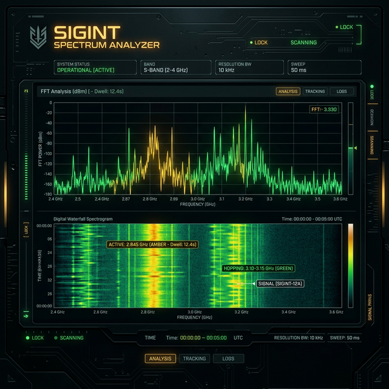

# 📡 WATERSPECT: Spektrumun Sessiz Gözcüsü

> [!CAUTION]
> **OPERASYONEL BİLGİ:** Bu sistem, elektromanyetik spektrumdaki görünmez savaşın bir simülasyonudur. Sinyaller sadece veri değildir; onlar birer "imza"dır.

## 🏹 Senaryo: Görünmeyeni Görmek

Modern harp meydanı artık sadece karada, denizde veya havada değil; **elektromanyetik spektrumun** her hertzinde yaşanıyor. Düşman radar sistemleri, telsiz haberleşmeleri ve insansız hava araçları (İHA) sürekli olarak yayın yaparak iz bırakır. Ancak bu yayınlar genellikle gürültü altına gizlenir veya çok kısa süreli (LPI - Low Probability of Intercept) gerçekleşir.

**WATERSPECT**, bu karmaşanın içinden anlamlı istihbaratı çekip çıkarmak için tasarlanmış bir **Sinyal İstihbaratı (SIGINT)** arayüzüdür. Operatör olarak göreviniz, gürültü tabanının üzerindeki her bir pik noktasını analiz etmek ve bu sinyallerin kime ait olduğunu, ne amaçla yayıldığını anlamaktır.

---

## 🔬 Olayın Matematiği: FFT ve Şelale Grafiği

Bu projede kullanılan iki temel görselleştirme tekniği, sinyal işlemenin kalbidir:

### 1. Hızlı Fourier Dönüşümü (FFT) - *Anlık Güç*
Zaman düzlemindeki karmaşık ses verilerini, frekans düzlemine dönüştürür. 
- **Mantık:** Gelen sinyali "kimyasal elementlerine" ayırmak gibidir. Hangi frekansta ne kadar güç (enerji) olduğunu bir çizgi grafik olarak görürsünüz.
- **Kullanım:** Bir radyo istasyonunun tam frekansını veya bir motorun çıkardığı gürültünün karakteristiğini burada tespit edersiniz.

### 2. Şelale Spektrogramı (Waterfall) - *Spektral Hafıza*
Spektrumun zaman içindeki geçmişini kaydeder.
- **Mantık:** FFT grafiği sürekli güncellenirken, eski veriler aşağı doğru kayar. Renkler (Isı Haritası) sinyal gücünü temsil eder.
- **Neden Önemli?** 
    - **Frekans Atlama (Frequency Hopping):** Sinyal spektrogramda kesik çizgiler şeklinde sağa sola zıplıyorsa, bu düşmanın frekans atlamalı (hopped) bir haberleşme kullandığını gösterir.
    - **Sinyal Kayması (Drift):** Bir sinyalin frekansı yavaşça değişiyorsa (eğik çizgi), bu bir Doppler kayması veya istikrarsız bir vericinin işareti olabilir.

---

## 🦾 Operasyonel Özellikler

-   **📡 Hibrit Veri Kaynağı:** İster yapay zeka tarafından üretilen karmaşık **simülasyon** sinyallerini, isterseniz mikrofonunuzdan gelen **gerçek dünya** seslerini analiz edin.
-   **🎯 Otomatik Hedef Tespiti:** Tanımladığınız "Eşik Değeri"ni aşan her yayın, sistem tarafından otomatik olarak "TEPE" olarak işaretlenir ve koordinatları (frekansı) günlüğe kaydedilir.
-   **⚡ Hız Kontrolü:** Şelale akışını hızlandırarak yüksek yoğunluklu taramalar yapabilir veya yavaşlatarak çok zayıf sinyallerin (LPI) izini sürebilirsiniz.
-   **📺 CRT Restorasyonu:** Operatörlerin göz yorgunluğunu azaltmak ve odaklanmayı artırmak için tasarlanmış nostaljik ama yüksek teknolojili tarama çizgileri ve flicker efektleri.

## 📖 Nasıl Kullanılır?

1.  **Sinyal Yakalama:** `KAYNAK` menüsünden "CANLI SİNYAL"i seçin. Etraftaki konuşmaların, ıslık seslerinin veya müziğin spektrumda nasıl birer "parmak izi" bıraktığını izleyin.
2.  **Filtreleme:** `EŞİK DEĞERİ` çubuğunu grafik üzerindeki kırmızı çizginin hemen üzerine getirin. Bu, sadece gerçek sinyallerin tespit edilmesini sağlar.
3.  **Analiz:** `MODÜLASYON TİPİ`ni "Frekans Atlamalı" yapın ve şelale üzerindeki örüntüleri incelemeye başlayın.

---

### 🏛️ Geliştiren: [Bahattin Yunus](https://github.com/bahattinyunus)
*Elektronik Harp ve Savunma Sistemleri Meraklısı*

**TASNİF DIŞI // BU PROJE BİR EĞİTİM VE SİMÜLASYON STANDIDIR.**
